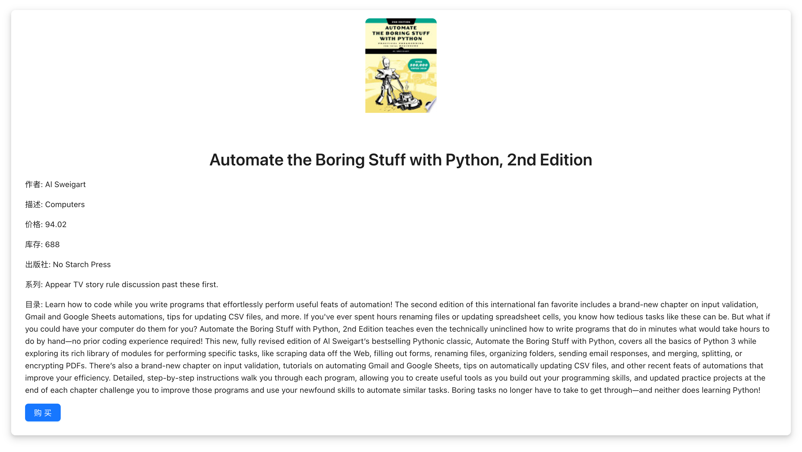
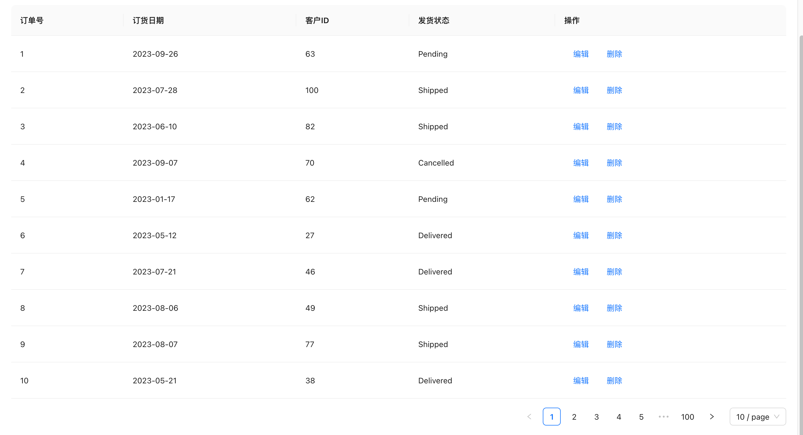
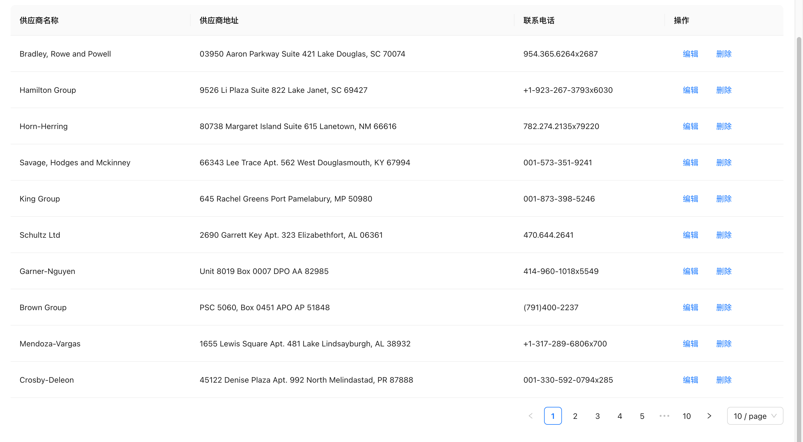
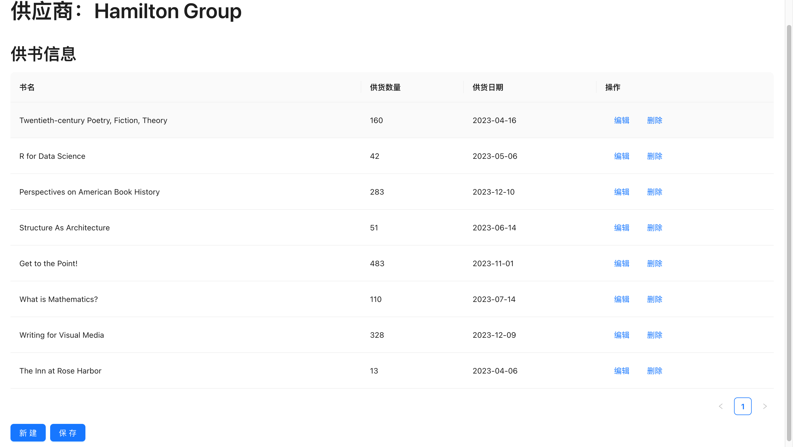
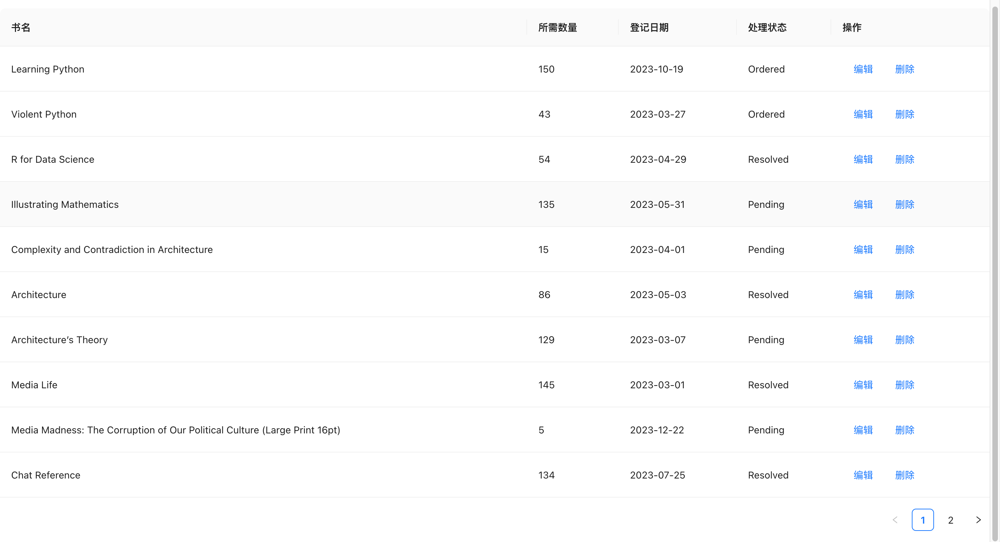
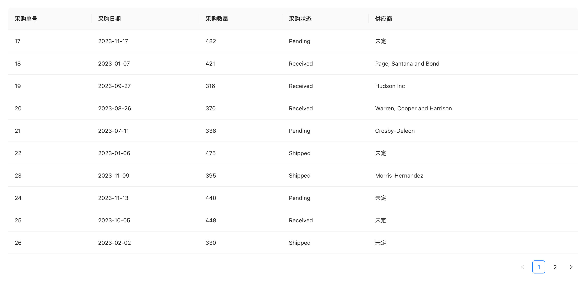
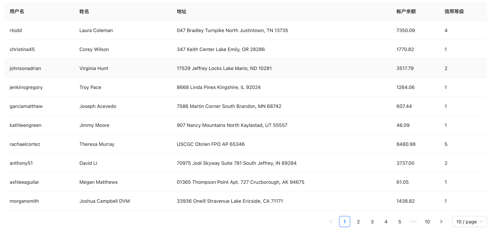
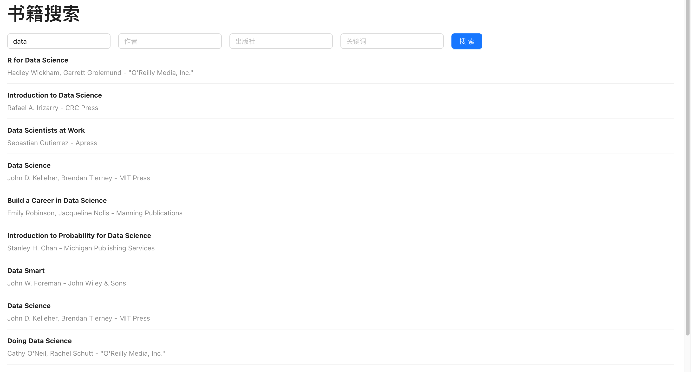

# OnlineBookStore

## 概述

本项目旨在设计和实现一个网上书店管理系统，以支持书店的日常运营及网上购书业务。系统的主要目标是提供一个高效、用户友好且功能全面的数据库应用，以管理从书目录到发货等各个方面的业务流程。通过综合运用现代数据库设计原则和技术，本系统旨在实现一个完整的书籍管理和交易系统。

在技术层面，本系统采用现代数据库技术，包括关系数据库的设计与实现、视图的创建、数据完整性约束的应用、以及存储过程和触发器的编写，以增强系统的自动化和效率。此外，特别关注于用户界面设计，以提供直观、易用的网上购书体验。系统设计考虑了易于维护和扩展的需要，以适应快速变化的业务需求和技术环境。

### 技术栈

- **数据库**：使用 MySQL 创建和管理后端数据库。
- **后端**：采用 Node.js 和 Express 框架构建 RESTful API，实现数据处理和业务逻辑。
- **前端**：使用 React 框架创建动态用户界面，与后端 API 进行交互。
- **工具**：使用 Sequelize 作为 ORM 工具，简化数据库操作；Ant Design 提供丰富的 UI 组件。

### 关键特性

1. **数据库设计**：设计了数据库模型，包括实体关系图和数据字典。数据库设计满足了系统的数据存储需求，同时保证了数据的完整性和一致性。
2. **前端实现**：通过 React 构建的前端提供了直观的用户界面，使用户能够轻松浏览书籍、管理订单和查看客户信息。
3. **后端实现**：后端 API 处理了从前端发来的请求，并与数据库进行交互，确保数据的准确和及时更新。
4. **搜索和过滤功能**：为用户提供了高效的书籍搜索和过滤工具，增强了用户体验。
5. **错误处理和验证**：在前端和后端都实现了错误处理和数据验证，保证了应用的健壮性。

本项目服务器总体结构：

├── controllers
│   ├── bookController.js               // 用于处理与书籍相关的业务逻辑。
│   ├── bookShortageController.js       // 用于处理书籍缺货的业务逻辑。
│   ├── customerController.js           // 用于处理与客户相关的业务逻辑。
│   ├── orderController.js              // 用于处理订单的业务逻辑。
│   ├── purchaseOrderController.js      // 用于处理采购订单的业务逻辑。
│   └── supplierController.js           // 用于处理供应商的业务逻辑。

├── middlewares
    // 存放中间件代码，例如身份验证、错误处理等。

├── models
│   ├── Book.js                         // 定义书籍的数据模型。
│   ├── BookShortage.js                 // 定义书籍缺货记录的数据模型。
│   ├── BookSupply.js                   // 定义书籍供应的数据模型。
│   ├── Customer.js                     // 定义客户的数据模型。
│   ├── Order.js                        // 定义订单的数据模型。
│   ├── OrderDetail.js                  // 定义订单详情的数据模型。
│   ├── PurchaseOrder.js                // 定义采购订单的数据模型。
│   ├── Supplier.js                     // 定义供应商的数据模型。
│   └── index.js                        // 用于导出所有数据模型。

├── routes
│   ├── bookShortages.js                // 定义处理书籍缺货相关路由的逻辑。
│   ├── books.js                        // 定义处理书籍相关路由的逻辑。
│   ├── customers.js                    // 定义处理客户相关路由的逻辑。
│   ├── orders.js                       // 定义处理订单相关路由的逻辑。
│   ├── purchaseOrders.js               // 定义处理采购订单相关路由的逻辑。
│   └── suppliers.js                    // 定义处理供应商相关路由的逻辑。

├── server.js
    // 应用程序的入口点，配置 Express 应用和路由。

├── tests
│   ├── books.test.js                   // 包含书籍相关的测试用例。
│   └── test.js                         // 其他通用测试用例。

└── utils
    ├── checkAndCreateBookShortages.js  // 包含检查和创建书籍缺货记录的工具函数。
    └── email.js                        // 包含发送电子邮件的工具函数。

**书店主页**

**书籍列表页面**

**书籍详情页面**

**订单管理页面**

**供应商管理页面**

**供应商供书详情页面**

**缺书登记页面**

**采购单管理**

**客户管理页面**

**用户注册页面**

**用户端详细信息页面**

**书籍搜索页面**

实现了四个关键词组合模糊搜索功能。

**历史订单页面**

